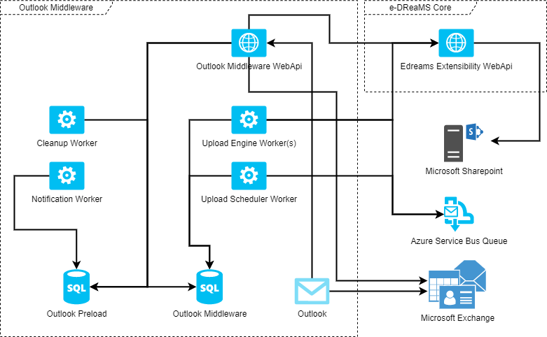
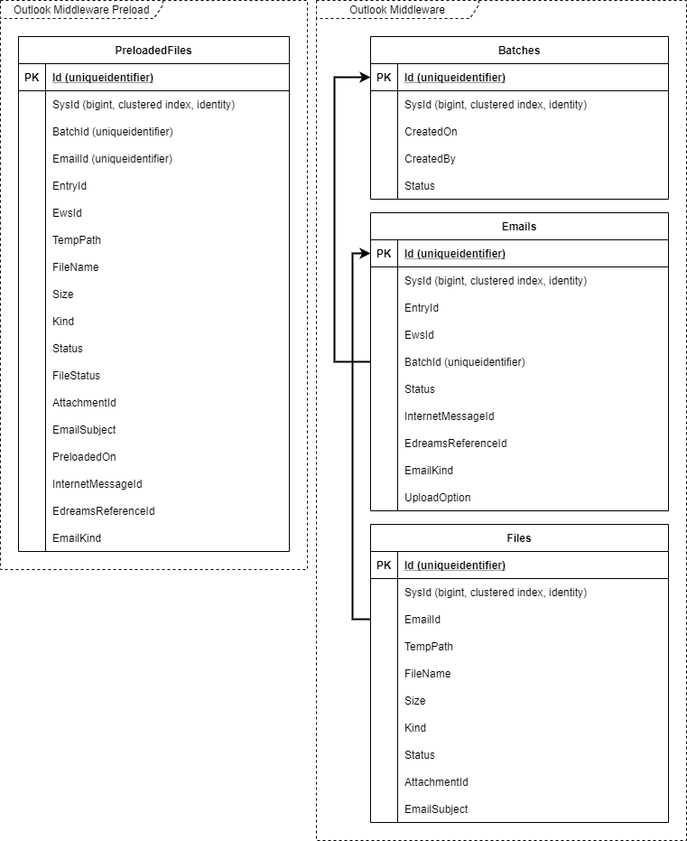
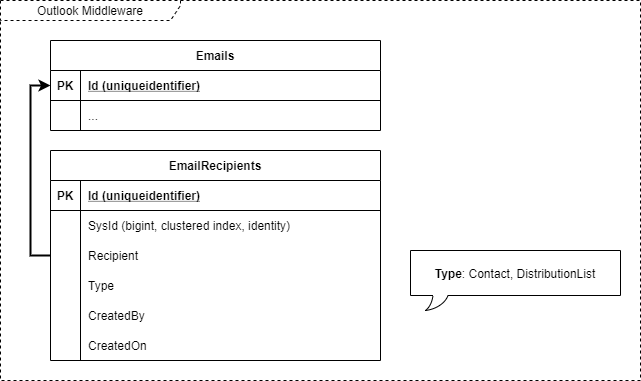
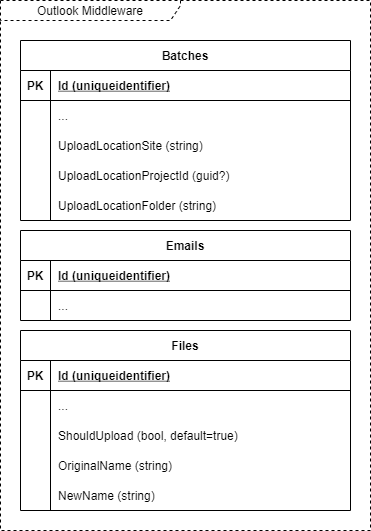
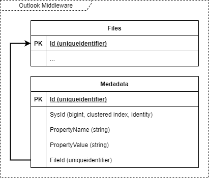
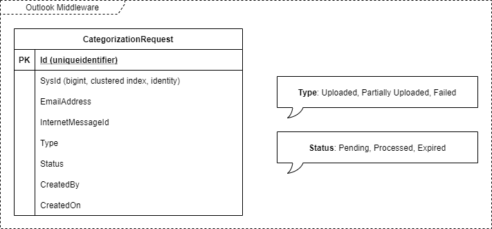

# e-DReaMS Outlook Middleware

Last modified by **Johnny Hooyberghs** on **July 29th 2021**

# Introduction

The e-DReaMS Outlook Middleware is an addition to the e-DReaMS platform that enables uploading emails from a local Outlook installation, using a plugin, to e-DReaMS.

The e-DReaMS Outlook Middleware is the backend API and processing platform for uploads. The e-DReaMS Outlook plugin is the frontend which is installed in Microsoft Outlook.

# Builds

| Build | Status |
|-------|--------|
| TODO  | TODO   |

# Table of Contents

* [Introduction](#introduction)
* [Builds](#builds)
* [Table of Contents](#table-of-contents)
* [Architecture](#architecture)
* [Database](#database)
* [Repository](#repository)

# Tye

For local development, all Outlook Middleware application services (WebApi and Workers) can be run as a whole by using [Project Tye](https://github.com/dotnet/tye). [Project Tye](https://github.com/dotnet/tye) allows you to configure the entire distributed application in a single YAML-file.

Tye is still an experimental tool, but already very helpful. Documentation can be found at [https://github.com/dotnet/tye/blob/master/docs/README.md](https://github.com/dotnet/tye/blob/master/docs/README.md).

You can install Tye, using PowerShell, by executing the following command. Please replace the version with the actual current version.

```
dotnet tool install -g Microsoft.Tye --version "0.6.0-alpha.21070.5"
```


# Architecture



The e-DReaMS Outlook Middleware is an e-DReaMS component which is loosely coupled to the e-DReaMS Core platform. Communication between e-DReaMS Core and the e-DReaMS Outlook Middleware only happens through the e-DReaMS Extensibility WebApi.

# Database

The e-DReaMS Outlook Middleware will use two separate databases. The first one, the preload-database, will contain only flat tables to quickly store preloaded data. The second one, the full database, will contain relational data that should be uploaded to e-DReaMS.

The decision for a separate database for preloaded data came from earlier experience with much data being preloaded from the Outlook plugin without being confirmed and polluting the already busy database.

## PreloadedFiles, Batches, Emails and Files



## Metadata

Metadata for emails that need to be uploaded to e-DReaMS is organized into relational data, linked to the emails and files records.

First of all, the recipients for an email will be extracted and sent as part of committing a batch. The recipient (email-address or distribution group name) will be stored with 







## CategorizationRequests



## ProjectTasks


# Repository

The e-DReaMS Outlook Middleware GIT repository contains a single Visual Studio solution. This solution contains all .NET Core, C# projects that represent the backend for the e-DReaMS Outlook Middleware: Database migration, WebApi and Windows Services.

<pre>
<b>Edreams.OutlookMiddleware.sln</b> (Visual Studio Solution)
|-- <b>0. Common</b> (Solution Folder)
|      |-- <b>Edreams.OutlookMiddleware.Common</b> <i>(*1*)</i> (.NET Core 3.1 Class Library)
|      |-- <b>Edreams.OutlookMiddleware.DataTransferObjects</b> <i>(*2*)</i> (.NET Standard 2.0 Class Library)
|      |-- <b>Edreams.OutlookMiddleware.Enums</b> <i>(*3*)</i> (.NET Standard 2.0 Class Library)
|      |-- <b>Edreams.OutlookMiddleware.Model</b> <i>(*4*)</i> (.NET Standard 2.0 Class Library)
|-- <b>1. API</b> (Solution Folder)
|      |-- <b>Edreams.OutlookMiddleware.Api</b> <i>(*5*)</i> (ASP.NET Core 3.1 WebApi)
|-- <b>2. Services</b> (Solution Folder)
|      |-- <b>Edreams.OutlookMiddleware.Services.Categorization.Engine</b> <i>(*6*)</i> (.NET Core 3.1 Worker Service)
|      |-- <b>Edreams.OutlookMiddleware.Services.Categorization.Scheduler</b> <i>(*7*)</i> (.NET Core 3.1 Worker Service)
|      |-- <b>Edreams.OutlookMiddleware.Services.Cleanup</b> <i>(*8*)</i> (.NET Core 3.1 Worker Service)
|      |-- <b>Edreams.OutlookMiddleware.Services.Notification</b> <i>(*9*)</i> (.NET Core 3.1 Worker Service)
|      |-- <b>Edreams.OutlookMiddleware.Services.Upload.Engine</b> <i>(*10*)</i> (.NET Core 3.1 Worker Service)
|      |-- <b>Edreams.OutlookMiddleware.Services.Upload.Scheduler</b> <i>(*11*)</i> (.NET Core 3.1 Worker Service)
|-- <b>3. Business Logic</b> (Solution Folder)
|      |-- <b>Edreams.OutlookMiddleware.BusinessLogic</b> <i>(*11*)</i> (.NET Core 3.1 Class Library)
|      |-- <b>Edreams.OutlookMiddleware.Mapping</b> <i>(*12*)</i> (.NET Standard 2.0 Class Library)
|-- <b>4. Data Access</b> (Solution Folder)
|      |-- <b>Edreams.OutlookMiddleware.DataAccess</b> <i>(*13*)</i> (.NET Core 3.1 Class Library)
|-- <b>9. Test Plugin</b> (Solution Folder)
|      |-- <b>Edreams.Outlook.TestPlugin</b> <i>(*14*)</i> (.NET Framework 4.6.1 VSTO plugin with WinForms support)
</pre>

### `(*1*)` Edreams.OutlookMiddleware.Common

The **Edreams.OutlookMiddleware.Common** project contains all common implementations that are used by the other projects.

### `(*2*)` Edreams.OutlookMiddleware.DataTransferObjects

The **Edreams.OutlookMiddleware.DataTransferObjects** project contains POCO (Plain Old CLR Object) classes for all objects used outside of the business logic. DTO's for the e-DReaMS Outlook Middleware are always based on requests and responses. A business logic method takes a request and returns a response.